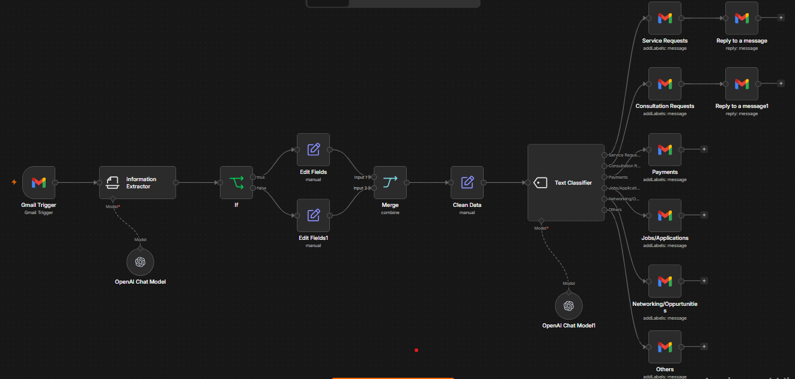

# Gmail Inbox Manager & Classifier

An n8n workflow that monitors a Gmail inbox, extracts key email information with OpenAI, and routes messages into useful categories. It can also send automated replies for selected message types.



## What it does

- Watches a Gmail inbox for new messages.
- Extracts structured information from each email.
- Classifies emails with an OpenAI chat model.
- Applies Gmail labels for:
  - Jobs / Applications
  - Networking / Opportunities
  - Service Requests
  - Consultation Requests
  - Payments
  - Others
- Sends replies for the workflow's configured message categories.

## Requirements

- A running n8n instance.
- Gmail OAuth2 credentials configured in n8n.
- OpenAI credentials configured in n8n.
- The Gmail labels listed above created in the connected Gmail account, or updated in the workflow to match your labels.

## Set up

1. Import [`Gmail Inbox Manager & Classifier.json`](Gmail%20Inbox%20Manager%20%26%20Classifier.json) into n8n.
2. Reconnect the Gmail and OpenAI credential references to credentials in your own n8n instance.
3. Review each Gmail label node and select or create the corresponding label.
4. Review the classifier categories and automated reply messages; customize them for your inbox.
5. Test the workflow with a non-sensitive email before activating it.

## Privacy and security

This repository intentionally contains no credential values and no pinned email data. Keep credentials in n8n's credential manager or environment variables—never commit API keys, OAuth tokens, passwords, or exported production data.

Because this workflow can read email contents and send replies, review its nodes and test carefully before enabling it on a live inbox.

## Project structure

```text
.
├── Gmail Inbox Manager & Classifier.json
├── workflow.png
├── .gitignore
└── README.md
```

## License

No license has been selected yet. Add one before sharing or accepting contributions if you want to define how others may use this workflow.
